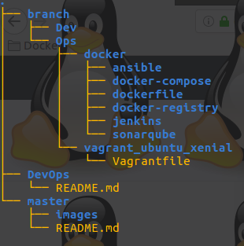

# DevOps Repository

### Structure and Content of the projet

├── branch
│   ├── Dev
│   └── Ops
│       ├── docker
│       │   ├── ansible
│       │   ├── docker-compose
│       │   ├── dockerfile
│       │   ├── docker-registry
│       │   ├── jenkins
│       │   └── sonarqube
│       └── vagrant_ubuntu_xenial
│           └── Vagrantfile
│
└── master
    ├── images
    │   └── repo-content.png
    └── README.md
